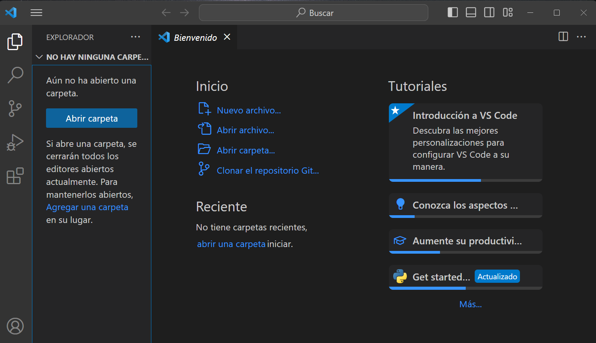
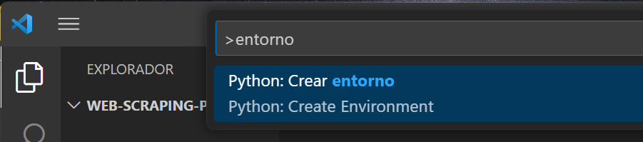
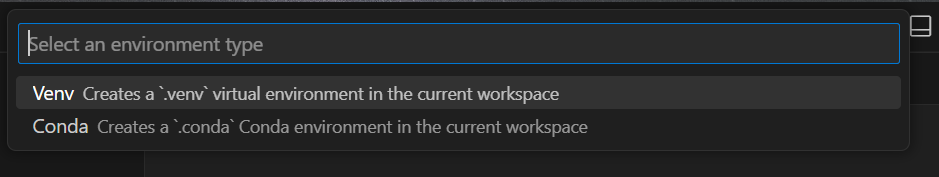
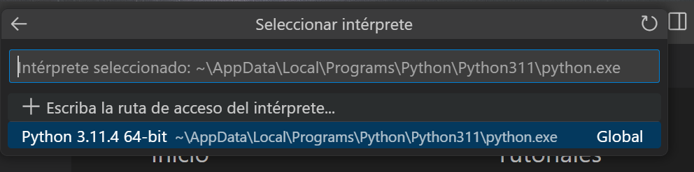
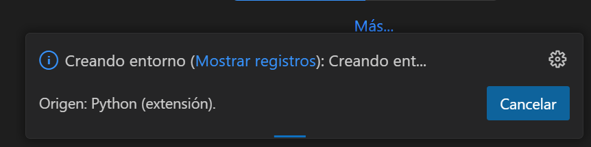
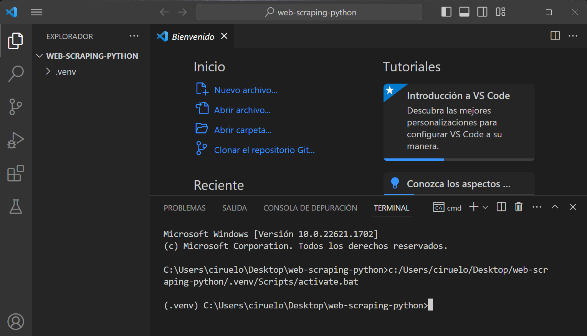

# Configuración de un entorno virtual en Visual Studio Code

> ~~NOTA: Al momento de escribir estas indicaciones (11/06/2023) existe un _bug_ en la extensión de Python de VSCode [que varias personas ya han reportado](https://github.com/microsoft/vscode-python/issues/21393). El problema hace que no se pueda ejecutar el código con `Shift + Enter`, ya que este no es enviado a la consola de Python sino al Terminal del computador. El error se produce al actualizar a la última versión de VSCode. Si a alguien le pasa esto, la sugerencia es volver a la versión de enero (1.75) hasta que se resuelva este problema. Pueden descargar esa versión desde acá: <https://code.visualstudio.com/updates/v1_75>. Es posible que VSCode te pida que vuelvas a instalar la extensión de Python. Para evitar que se actualice automáticamente mientras esperamos el arreglo, hay que ir al menú de configuración (`Ctrl/Cmd + ,` o desde el ícono :gear: abajo a la izquierda), escribir "Actualizar" en el buscador, hacer clic en el resultado bajo "Aplicación" y en **Update: mode** cambiar la opción a _manual_.~~
> 
> **¡Ya resolvieron el problema! Así que ya se puede trabajar con la versión más reciente**


## Instalaciones previas

Para utilizar Visual Studio Code como nuestro editor de código necesitamos instalar tres cosas: [Python](https://www.python.org/downloads/), [Visual Studio Code](https://code.visualstudio.com/download) y la extensión de Python en Visual Studio Code. 

## Configuración de un entorno virtual

Para trabajar en clases crearemos un _entorno virtual_. Hacemos esto para evitar conflictos entre el código que escribirmos y las distintas versiones de Python o de las librerías que vamos instalando en nuestro computador. Esto nos asegura que el código que ejecutamos en este proyecto en particular seguirá funcionando en el futuro, independiente de que actualicemos la versión de Python o que instalemos una versión más reciente de alguna librería para trabajar en otro proyecto. 


### Paso 1: Abrir nuestra carpeta de trabajo en VS Code

El entorno virtual se crea dentro de la carpeta principal de nuestro proyecto. Para ello, entonces, lo primero es tenerla abierta en VS Code. Puedes abrirla desde el explorador que está al lado izquierdo de la ventana, desde el menú **Archivo** > **Abrir carpeta**, o con el atajo `Ctrl/Cmd + K + Ctrl/Cmd + O`. 



### Paso 2: Buscar en la paleta de comandos la opción para crear el entorno

Puedes abrir la paleta de comandos con `Ctrl/Cmd + Shift + P` o desde el ícono :gear: abajo a la izquierda. Una vez abierta escribe "entorno" (o "environment", si es que tienes la interfaz en inglés). Elige la opción **Python: Crear entorno**.



### Paso 3: Selecciona el entorno

VS Code te ofrecerá dos opciones para crear el entorno: Venv y Conda. Para este ejemplo seleccionaremos Venv, que es la opción por defecto si es que instalaste Python desde <https://www.python.org>. Para ocupar la opción de crear el entorno con Conda tienes que haber instalado Conda (o miniconda) primero. Si estás en Windows e instalaste Python por primera vez con conda o miniconda, entonces elige esta opción.



### Paso 4: Seleccionar la versión de Python

Probablemente solo te aparezca una versión si tu sistema operativo es Windows y recién estás empezando a usar Python. Mac y Linux traen una versión pre-instalada, así que es probable que en ese caso te aparezcan dos versiones: la que venía en el sistema y la que instalaste tú cuando comenzaste el Diplomado. Elige la más reciente. 



Si elegiste como entorno Venv y no te aparece ninguna versión de Python, intenta creando el ambiente con Conda. 

Una vez que seleccionas la versión de Python, el entorno comienza a crearse. Te aparecerá un mensaje como este en la esquina inferior izquierda de la ventana:



¡Listo! En el explorador deberías ver ahora un nuevo directorio dentro de tu carpeta principal que se llama `.venv` (o `.conda`, si es que elegiste esa opción).

### Paso 5: instalar librerías

Abre un nuevo terminal desde el menú **Terminal** > **Nuevo terminal**:



Si te fijas, antes de la ruta de la carpeta aparece `(.venv)`, lo que nos confirma que estamos dentro del entorno virtual. Si creaste el entorno con Conda, entonces aparecerá `.conda`

Para instalar las librerías, debes escribir ahí directamente el código para hacerlo. Las que utilizamos durante la primera clase se instalan así: 

```
pip install beautifulsoup4
pip install requests
pip install pandas
```

Si te surge cualquier error durante el proceso, puedes poner la captura de pantalla en nuestro documento compartido. 

### Una librería adicional

Al final de la próxima clase mostraré como se ve el proceso de interactuar con una página dinámica para hacer web scraping. Si quieres replicar el ejemplo luego de la clase (quedará el código disponible), es necesario que instales selenium con:

```
pip install selenium
````

También es necesario que tengas instalado el navegador Firefox. El ejemplo no funcionará ni con Chrome, ni con Edge ni con Safari. (Se puede hacer con Chrome, pero hay que instalar más cosas. Queda como tarea para el futuro).
¡Ah! Y lo más importante: para implementar este ejemplo tienes que estar en VS Code. No va a resultar en Google Colab (porque hay que hacer configuraciones adicionales y porque internamente Colab usa Chrome).
